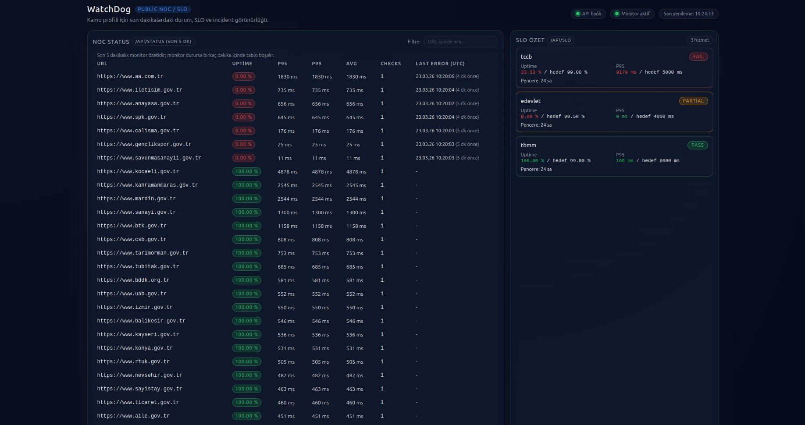

***

```markdown
# WEB-MONITOR (WatchDog)

Nüfus ve Vatandaşlık İşleri Genel Müdürlüğü (NVİ) bünyesindeki staj sürecimde geliştirdiğim bu proje; kamu ve özel web servislerini merkezi olarak izlemek için tasarlanmış, self-hosted bir web monitor uygulamasıdır. Sistem; hedef URL'leri periyodik olarak kontrol eder, uptime/latency (gecikme) verilerini kaydeder, kesinti anlarını "incident" (olay) olarak raporlar ve hem API, hem dashboard hem de Prometheus metrikleri üzerinden operasyon ekiplerine tam görünürlük sağlar.

## Portfolyo Özeti

Bu projeyi tek başıma, üretim (production) mantığına yakın bir yaklaşımla geliştirdim: Asenkron izleme motoru, SQLite tabanlı veri katmanı, FastAPI ile dashboard API'si, Docker tabanlı çalıştırma mimarisi ve GitHub Actions ile kalite kontrol adımlarını tek bir sistemde topladım. Amacım; kurum içi veya internete açık kritik servislerin kesinti ve performans problemlerini erken tespit edebilen, düşük maliyetli ve yüksek oranda özelleştirilebilir bir monitoring çözümü oluşturmaktı.

## Proje Görseli



---

## Hangi Problemleri Çözer?

- Dağınık servislerin merkezi olarak izlenmesi
- Kesinti anlarının otomatik tespiti ve loglanması
- Sadece "up/down" durumu değil, gecikme (latency) bazlı kalite takibi
- CI ve operasyon akışlarında SLO (Service Level Objective) odaklı kontrol
- Küçük ve orta ölçekli ekipler için self-hosted, düşük maliyetli monitor altyapısı sunması

## Hedef Kitle

- Bireysel geliştiriciler
- KOBİ teknik ekipleri
- DevOps / SRE mühendisleri
- Kurum içi NOC (Network Operations Center) ve sistem yönetimi ekipleri

---

## Kullanılan Teknolojiler

### Backend / Core
- Python 3.10+
- asyncio + aiohttp (Asenkron check motoru)
- FastAPI + Uvicorn (Dashboard API)

### Data / Storage
- SQLite (Yüksek performans için WAL modu)
- aiosqlite

### Frontend
- HTML + CSS + Vanilla JavaScript (Statik, hafif dashboard)

### DevOps / Operasyon
- Docker + Docker Compose
- Nginx reverse proxy (Metrics/health proxy ve Basic Auth)
- GitHub Actions (CI Pipeline)
- Ruff + Pytest + Compile check + Gitleaks

---

## Mimari Özet

1. Hedef listesi (`targets.yaml` veya `links.txt`) sisteme yüklenir.
2. Monitor worker, asenkron dalgalar (waves) halinde HTTP kontrollerini gerçekleştirir.
3. Sonuçlar asenkron olarak SQLite veritabanına yazılır.
4. Incident ve anlık durum bilgileri API ve CLI katmanına sunulur.
5. Frontend Dashboard, API'den periyodik veri çekerek son durumu görselleştirir.
6. Prometheus `/metrics` endpoint'i, metrikleri dış sistemlerin okumasına açar.

**Kısa Akış:**
`Targets -> Async Runner -> SQLite -> API/CLI/Metrics -> Dashboard`

---

## Öne Çıkan Özellikler

- Asenkron monitor döngüsü (Yüksek hedef sayısında stabil çalışma)
- Retry + Jitter + Timeout guardrail'leri
- AIMD backpressure algoritması ile adaptif concurrency
- Incident raporlama (Down / Resolved durum geçişleri)
- SLO raporlaması (`--slo-report`)
- Konfigürasyon doğrulama (`--validate-config`)
- Profil bazlı hedef dosyası geçiş desteği
- Slack / SMTP / Webhook / PagerDuty bildirim (notifier) destekleri
- Konteynerize (Dockerized) çalıştırma ve CI pipeline entegrasyonu

---

## Hızlı Başlangıç

Detaylı kurulum adımları için `KURULUM.md` dosyasına göz atabilirsiniz.

Opsiyonel olarak `.env.example` dosyasını kopyalayıp kendi ortamınıza göre doldurabilirsiniz:

```bash
cp .env.example .env
```

**En hızlı lokal demo için:**

```bash
cd /home/arda/software/WEB-MONITOR
python -m venv .venv
source .venv/bin/activate
pip install -r watchdog/requirements.txt

export WATCHDOG_TARGETS_FILE=watchdog/links.txt
export WATCHDOG_DB_PATH=watchdog.db

python watchdog/main.py --monitor
```

**Dashboard API'sini ayağa kaldırmak için (Ayrı bir terminalde):**

```bash
cd /home/arda/software/WEB-MONITOR/watchdog
source /home/arda/software/WEB-MONITOR/.venv/bin/activate
uvicorn src.api.app:app --host 0.0.0.0 --port 8001
```

Tarayıcınızdan şu adrese giderek arayüzü görüntüleyebilirsiniz:
`http://localhost:8001`

---

## `links.txt` ile Kullanım

Bu projede hedefleri düz metin (plain text) URL listesi olarak doğrudan kullanabilirsiniz.

**Örnek `links.txt` içeriği:**
```text
[https://example.com](https://example.com)
[https://www.turkiye.gov.tr](https://www.turkiye.gov.tr)
[https://www.google.com](https://www.google.com)
```

**Çalıştırma:**
```bash
export WATCHDOG_TARGETS_FILE=watchdog/links.txt
python watchdog/main.py --monitor
```

İsterseniz `links.txt` dosyasını yapılandırılmış YAML formatına çevirebilirsiniz:
```bash
python watchdog/scripts/links_to_targets.py \
  --links-file watchdog/links.txt \
  --output-file watchdog/config/targets_links.yaml
```

---

## Docker ile Çalıştırma

Konteyner mimarisi ile projeyi hızlıca ayağa kaldırmak için:

```bash
cd /home/arda/software/WEB-MONITOR
docker compose up -d --build
docker compose ps
```

**Ayağa Kalkan Servisler:**
- `watchdog-monitor`
- `watchdog-metrics`
- `watchdog-nginx`

**Sistem Kontrolü (Health Check):**
```bash
curl -s http://localhost:8080/health
```

**Sistemi Kapatma:**
```bash
docker compose down
```

---

## CI/CD (GitHub Actions)

`.github/workflows/ci.yml` dosyasında iki ana job (görev) tanımlıdır:

1. **secrets:** Gitleaks aracı ile kod tabanında secret/credential taraması.
2. **test:** Python matrix üzerinde linting, format kontrolü, birim testleri ve compile check.

**Çalışan temel adımlar:**
- `ruff check .`
- `ruff format --check .`
- `pytest watchdog`
- `python -m compileall watchdog/src`

---

## Güvenlik Notları

- `.env` ve `.env.*` dosyaları versiyon kontrolüne (git) dahil edilmemiştir.
- SMTP, Slack vb. hassas API bilgileri environment (ortam) değişkeni olarak sisteme verilir.
- Varsayılan SSRF (Server-Side Request Forgery) korumaları aktiftir (Private IP engeli vb.).
- `Metrics` endpoint'ini production (canlı) ortamında Auth veya Network Policy ile korumanız tavsiye edilir.
- Detaylı teknik güvenlik ve operasyon notları için: `watchdog/docs/OPERASYON_VE_MIMARI_NOTLARI.md`

---

## Proje Yapısı

```text
WEB-MONITOR/
├─ watchdog/
│  ├─ main.py
│  ├─ links.txt
│  ├─ config/
│  ├─ src/
│  │  ├─ api/
│  │  ├─ core/
│  │  ├─ infrastructure/
│  │  ├─ models/
│  │  └─ services/
│  └─ tests/
├─ docker-compose.yml
├─ KURULUM.md
├─ README.md
└─ images/
```

---

## Geliştirici

**Arda Karadağ**

*Bu proje, T.C. İçişleri Bakanlığı Nüfus ve Vatandaşlık İşleri Genel Müdürlüğü (BVYS - Yazılım Geliştirme) bünyesinde gerçekleştirilen staj çalışması kapsamında geliştirilmiştir.*
```

***
