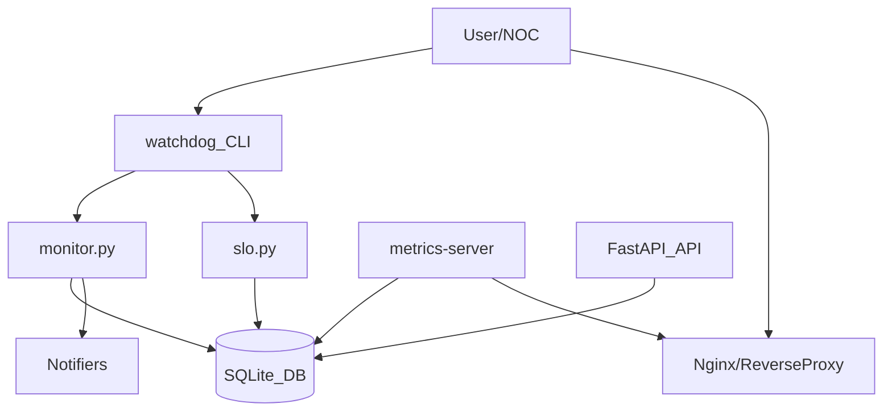

## WatchDog – Async Uptime & Service Monitor

WatchDog, HTTP tabanlı servislerinizin uptime ve gecikme metriklerini sürekli izleyen,
sonuçları SQLite veritabanına yazan ve hem CLI raporları hem de Prometheus uyumlu
metrikler üreten hafif bir SRE aracıdır.

### Özellikler

- **Asenkron monitor loop**: Yüzlerce hedefi tek prosesle izleyen aiohttp tabanlı denetimler.
- **SQLite depolama**: Tek writer (monitor) ve hafif reader'lar (CLI, metrics, API) için optimize.
- **Zengin CLI**: Uptime/latency raporları, NOC status tablosu, incident listesi, SLO raporu, CI check.
- **Prometheus metrics server**: `watchdog-metrics` servisi üzerinden text formatta metrikler.
- **Profil desteği**: Farklı `.env.{profile}` ve `targets_{profile}.yaml` set’leriyle kolay profil switching.
- **SLO ve CI entegrasyonu**: `slo.yaml` ile SLO hesaplama, `critical_ci_services.yaml` ile CI gate.
- **Docker & docker-compose**: Tek komutla lokal stack, production’a yakın ayarlarla.

---

## Hızlı Başlangıç

### Local kurulum (Python 3.10+)

```bash
git clone <repo-url> WEB-MONITOR
cd WEB-MONITOR

python -m venv .venv
source .venv/bin/activate

pip install -r watchdog/requirements.txt
```

### Quick demo (tek komut)

Repo root’tan:

```bash
bash scripts/demo.sh
```

Beklenenler (kısaltılmış):

- `validate-config` “All configuration checks passed successfully.” yazar
- `metrics-server` `/health` için `{"status": "ok"}` döner
- `/metrics` çıktısında `watchdog_*` metrikleri görünür

Basit bir hedef dosyasıyla monitor loop'u başlat:

```bash
export WATCHDOG_TARGETS_FILE=watchdog/config/targets.yaml  # veya kendi YAML dosyan
export WATCHDOG_DB_PATH=watchdog.db                       # varsayılan zaten bu

python watchdog/main.py --monitor
```

CLI komutlarını doğrudan paket olarak kullanmak istersen:

```bash
cd watchdog
pip install -e .

watchdog --monitor
```

Minimum Python versiyonu: **3.10**.

### Docker ile hızlı başlatma

Proje köküne geç:

```bash
cd /home/arda/software/WEB-MONITOR   # kendi yoluna göre düzenle
```

Tüm servisleri ayağa kaldır:

```bash
docker compose up -d --build
```

Beklenen servisler:

- `watchdog-monitor`
- `watchdog-metrics`
- `watchdog-nginx`

Durumu kontrol etmek için:

```bash
docker compose ps
```

Stack’i temizce kapatmak için:

```bash
docker compose down
```

Targets dosyasını (`watchdog/config/targets.yaml` veya diğer `targets_*.yaml`)
güncelledikten sonra yeniden başlatmak için:

```bash
docker compose up -d --build
```

---

## Konfigürasyon

Konfigürasyonun ana kaynağı `AppSettings` sınıfıdır (`src/core/config.py`). Değerler
environment değişkenlerinden ve opsiyonel `.env` / `.env.{profile}` dosyalarından yüklenir.

### Önemli `WATCHDOG_*` environment değişkenleri

- **WATCHDOG_DB_PATH**: SQLite dosya yolu.
  - Varsayılan: `watchdog.db` (Docker imajında `/app/data/watchdog.db`).
- **WATCHDOG_TARGETS_FILE**: İzlenecek hedeflerin bulunduğu YAML dosyasının yolu.
  - Varsayılan: `config/targets.yaml`.
  - Docker imajında tipik kullanım: `/app/config/targets.yaml`.
- **WATCHDOG_POLL_INTERVAL_SECONDS**: İki health check dalgası arasındaki süre.
  - Varsayılan: `30.0`.
- **WATCHDOG_REQUEST_TIMEOUT_SECONDS**: HTTP istek timeout süresi.
  - Varsayılan: `10.0`, üst sınır: **60.0**.
  - **Kural**: `WATCHDOG_REQUEST_TIMEOUT_SECONDS < WATCHDOG_POLL_INTERVAL_SECONDS` olmalı.
- **WATCHDOG_MAX_CONCURRENT_REQUESTS**: Aynı anda yapılabilecek maksimum HTTP istek sayısı.
  - Varsayılan: `100`.
- **WATCHDOG_RETENTION_DAYS**: Veritabanında tutulacak gün sayısı.
  - Varsayılan: `7`.
- **WATCHDOG_MAX_RETRIES**: Geçici hatalar için maksimum retry sayısı.
  - Varsayılan: `2`, üst sınır: **5**.
- **WATCHDOG_SLACK_WEBHOOK_URL**: Slack uyarıları için opsiyonel webhook URL’si.
- **WATCHDOG_HEARTBEAT_PING_URL**: Her başarılı dalga sonunda ping atılacak deadman switch URL’si.
- **WATCHDOG_ALLOW_PRIVATE_IPS**: `true` ise private/loopback IP’lere izin verilir.
  - Varsayılan: `false` (SSRF koruması için güvenli varsayılan).
- **WATCHDOG_SMTP_HOST/PORT/USERNAME/PASSWORD/FROM/TO**: E-posta notifiers için SMTP ayarları.
- **WATCHDOG_CI_CRITICAL_SERVICES_FILE**: CI modunda kritik servisleri tanımlayan YAML yolu.
- **WATCHDOG_MAINTENANCE_WINDOWS_FILE**: Bakım pencerelerini tanımlayan YAML yolu.

### Profiller ve `WATCHDOG_PROFILE`

Profil adı vererek farklı hedef set’leri ve `.env` dosyaları kullanabilirsin:

- CLI:

```bash
python watchdog/main.py --monitor --profile public_institutions
```

- Bu durumda:
  - `.env` yüklenir, ardından `.env.public_institutions` ile override edilir.
  - `WATCHDOG_TARGETS_FILE` env explicitly set değilse, varsayılan hedef dosyası
    `config/targets_public_institutions.yaml` olur.

Manuel hedef dosyası seçmek için doğrudan env üzerinden ayarlayabilirsin:

```bash
export WATCHDOG_TARGETS_FILE=watchdog/config/targets_chaos.yaml
python watchdog/main.py --monitor
```

Docker tarafında ise:

```yaml
environment:
  WATCHDOG_TARGETS_FILE: /app/config/targets_public_institutions_expanded.yaml
```

### Email notifier (SMTP) hızlı kurulum

Email uyarıları, **SMTP** üzerinden çalışır ve sadece şu alanlar doluysa aktif olur:

- `WATCHDOG_SMTP_HOST`
- `WATCHDOG_SMTP_FROM`
- `WATCHDOG_SMTP_TO`

Opsiyonel ama çoğu provider için gerekli:

- `WATCHDOG_SMTP_USERNAME`
- `WATCHDOG_SMTP_PASSWORD`

Örnek (Gmail / App Password ile):

```bash
export WATCHDOG_SMTP_HOST=smtp.gmail.com
export WATCHDOG_SMTP_PORT=587
export WATCHDOG_SMTP_USERNAME="karadagarda06@gmail.com"
export WATCHDOG_SMTP_PASSWORD="<gmail-app-password>"
export WATCHDOG_SMTP_FROM="karadagarda06@gmail.com"
export WATCHDOG_SMTP_TO="karadagarda06@gmail.com"
```

Not: Gmail için normal şifre değil, **App Password** kullanman gerekir.

#### Önemli not (repo’yu klonlayanlar için)

- WatchDog **kimseye otomatik email atmaz**. Email uyarıları varsayılan olarak kapalıdır.\n- Email gönderebilmek için SMTP bilgilerini **senin** vermen gerekir (environment veya `.env`).\n- Bu repo **SMTP kullanıcı adı/şifresi içermez**. `.env` dosyaları `.gitignore` ile dışlanır.\n\nSMTP ayarlarını hızlı doğrulamak için tek seferlik test mail:\n\n```bash\npython watchdog/main.py --send-test-email\n```\n\nBu komut, `WATCHDOG_SMTP_*` ayarların doğruysa “sent successfully” yazar; yanlışsa hatayı ekrana basar.

---

## Temel CLI Komutları

Tüm komutlar kökten:

```bash
python watchdog/main.py <mode> [opsiyonlar]
```

veya paketten:

```bash
watchdog <mode> [opsiyonlar]
```

### `--monitor`

Sürekli health check yapan ana monitor döngüsünü başlatır.

```bash
WATCHDOG_TARGETS_FILE=watchdog/config/targets.yaml \
WATCHDOG_DB_PATH=watchdog.db \
python watchdog/main.py --monitor
``>

### `--report`

Son saatlerin uptime/latency özetini tablo olarak yazdırır.

```bash
python watchdog/main.py --report --last-hours 1
```

### `--status`

NOC için daraltılmış görünüm – son N dakikanın kısa tablosu.

```bash
python watchdog/main.py --status --last-minutes 5
```

### `--incidents`

Belirli bir pencere içindeki kesintileri (incident) listeler.

```bash
python watchdog/main.py --incidents --last-hours 24
```

### `--metrics-server`

Prometheus formatında metrik sunan küçük bir HTTP server açar.

```bash
python watchdog/main.py --metrics-server --metrics-host 0.0.0.0 --metrics-port 9100
```

Docker compose içindeki `watchdog-metrics` servisi bu modu kullanır.

### `--slo-report`

`watchdog/config/slo.yaml` dosyasına göre SLO raporu üretir (repo root’tan veya `watchdog/` içinden çalıştırılabilir).

```bash
python watchdog/main.py --slo-report --last-hours 24
```

### `--validate-config`

`.env` ve targets konfigürasyonunu doğrular, hataları listeler.

```bash
python watchdog/main.py --validate-config
```

---

## Docker & docker-compose ile kullanım

`Dockerfile`, `watchdog` klasörünü `/app` altına kopyalar ve varsayılan olarak:

- `WATCHDOG_DB_PATH=/app/data/watchdog.db`
- `WATCHDOG_TARGETS_FILE=/app/config/targets.yaml`

değerlerini set eder ve:

```bash
CMD ["python", "main.py", "--monitor"]
```

ile monitor modunu başlatır.

### Örnek `watchdog-monitor` servisi (docker-compose.yml)

```yaml
services:
  watchdog-monitor:
    build:
      context: .
      dockerfile: Dockerfile
    container_name: watchdog-monitor
    restart: unless-stopped
    environment:
      WATCHDOG_DB_PATH: /app/data/watchdog.db
      WATCHDOG_TARGETS_FILE: /app/config/targets_public_institutions_expanded.yaml
      WATCHDOG_POLL_INTERVAL_SECONDS: 60
      WATCHDOG_REQUEST_TIMEOUT_SECONDS: 5
      WATCHDOG_MAX_CONCURRENT_REQUESTS: 50
      WATCHDOG_MAX_RETRIES: 2
      WATCHDOG_SLACK_WEBHOOK_URL: ${WATCHDOG_SLACK_WEBHOOK_URL:-}
      WATCHDOG_CI_CRITICAL_SERVICES_FILE: /app/config/critical_ci_services.yaml
      WATCHDOG_MAINTENANCE_WINDOWS_FILE: /app/config/maintenance_windows.yaml
    volumes:
      - watchdog-db:/app/data
      - ./watchdog/config/targets_public_institutions_expanded.yaml:/app/config/targets_public_institutions_expanded.yaml:ro
      - ./watchdog/config/critical_ci_services.yaml:/app/config/critical_ci_services.yaml:ro
```

### Metrics servisi ve Nginx

`watchdog-metrics` servisi, metrikleri Prometheus formatında sunar:

```yaml
  watchdog-metrics:
    build:
      context: .
      dockerfile: Dockerfile
    container_name: watchdog-metrics
    restart: unless-stopped
    environment:
      WATCHDOG_DB_PATH: /app/data/watchdog.db
      WATCHDOG_TARGETS_FILE: /app/config/targets_public_institutions_expanded.yaml
      WATCHDOG_POLL_INTERVAL_SECONDS: 30
      WATCHDOG_REQUEST_TIMEOUT_SECONDS: 10
      WATCHDOG_MAX_CONCURRENT_REQUESTS: 100
      WATCHDOG_MAX_RETRIES: 2
      WATCHDOG_SLACK_WEBHOOK_URL: ${WATCHDOG_SLACK_WEBHOOK_URL:-}
    volumes:
      - watchdog-db:/app/data
      - ./watchdog/config/targets_public_institutions_expanded.yaml:/app/config/targets_public_institutions_expanded.yaml:ro
    command: ["python", "main.py", "--metrics-server", "--metrics-host", "0.0.0.0", "--metrics-port", "8000"]
    expose:
      - "8000"
```

Nginx, health ve metrics endpoint’lerini expose eder ve Basic Auth uygulayabilir:

```bash
cd /home/arda/software/WEB-MONITOR
mkdir -p nginx
htpasswd -c ./nginx/htpasswd prometheus   # parola sorar
docker compose restart nginx
```

Ardından:

```bash
curl -s http://localhost:8080/health
curl -s -u prometheus:<parola> http://localhost:8080/metrics | head -40
```

### Örnek production compose iskeleti

Prod ortamı için tipik bir iskelet:

```yaml
services:
  watchdog-monitor:
    image: ghcr.io/<org>/watchdog-monitor:<tag>
    restart: unless-stopped
    environment:
      WATCHDOG_DB_PATH: /app/data/watchdog.db
      WATCHDOG_TARGETS_FILE: /app/config/targets.yaml
      WATCHDOG_POLL_INTERVAL_SECONDS: 60
      WATCHDOG_REQUEST_TIMEOUT_SECONDS: 5
      WATCHDOG_MAX_CONCURRENT_REQUESTS: 50
      WATCHDOG_MAX_RETRIES: 2
      WATCHDOG_SLACK_WEBHOOK_URL: ${WATCHDOG_SLACK_WEBHOOK_URL:-}
    volumes:
      - watchdog-db:/app/data
      - ./config/targets.yaml:/app/config/targets.yaml:ro

  watchdog-metrics:
    image: ghcr.io/<org>/watchdog-monitor:<tag>
    restart: unless-stopped
    command: ["python", "main.py", "--metrics-server", "--metrics-host", "0.0.0.0", "--metrics-port", "8000"]
    environment:
      WATCHDOG_DB_PATH: /app/data/watchdog.db
      WATCHDOG_TARGETS_FILE: /app/config/targets.yaml
    volumes:
      - watchdog-db:/app/data
      - ./config/targets.yaml:/app/config/targets.yaml:ro

volumes:
  watchdog-db:
```

SSL terminasyonu ve internet’e açılma işi genellikle ayrı bir ters proxy (Traefik, başka bir Nginx,
cloud load balancer vb.) tarafında yapılmalıdır.

---

## Konfig dosyaları ve örnekler

Konfigürasyon dosyaları `watchdog/config` altında toplanır:

- `targets.yaml`: Basit birkaç hedef içeren default dosya.
- `targets_public_institutions.yaml` / `_expanded.yaml`: Kamu kurumları dataset’i; load test için ideal.
- `targets_chaos.yaml`: Hata ve backpressure senaryolarını tetikleyen chaos profili.
- `targets_backup.yaml` / `targets_links.yaml`: Alternatif hedef set’leri.
- `slo.yaml`: SLO tanımlarını içerir.
- `critical_ci_services.yaml`: CI pipeline’ında kritik kabul edilen URL’lerin listesi.
- `maintenance_windows.yaml`: Bakım pencerelerini tanımlayan yapı.

### Minimal config quickstart

Tek bir hedefle hızlıca denemek için yeni bir dosya oluştur:

```yaml
# watchdog/config/targets_minimal.yaml
targets:
  - url: "https://example.com/health"
    expected_status: 200
    request_timeout_seconds: 5
    max_retries: 1
```

Sonra:

```bash
export WATCHDOG_TARGETS_FILE=watchdog/config/targets_minimal.yaml
python watchdog/main.py --monitor
```

---

## Security & SRE Considerations

### Response body sınırı (`MAX_BODY_BYTES`)

HTTP health check’lerinde response body en fazla ilk **50KB** kadar okunur ve
`expected_body_substring` ile `expected_json_*` kontrolleri sadece bu kısım üzerinde
çalışır. Çok büyük body’lere sahip endpoint’lerde aranan substring veya JSON alanı
daha sonra geliyorsa false negative sonuçlar oluşabilir; prod’da bu hedefler için
özel, küçük payload’lı health endpoint’leri kullanman önerilir.

### SQLite mimarisi (tek writer için optimize)

WatchDog varsayılan olarak tek writer (monitor loop) ve hafif reader'lar (API / metrics)
için optimize edilmiş gömülü bir SQLite veritabanı kullanır. Yüksek hacimli raporlama,
ağır analitik sorgular veya yüksek QPS dashboard senaryoları için verileri periyodik
olarak export edip harici bir veritabanına (örn. PostgreSQL) aktarman ve bu sorguları
orada çalıştırman önerilir.

### SSRF korumaları ve `allow_private_ips`

- Yalnızca `http` ve `https` şemalarına izin verilir.
- Varsayılan olarak private/loopback IP’lere istek yapılmaz; bu adreslere resolve olan
  hedefler DOWN kabul edilir.
- `WATCHDOG_ALLOW_PRIVATE_IPS=true` set edilmediği sürece, iç network’teki servisler
  için bu korumayı by-pass edemezsin.

Bu davranış, özellikle internet’ten gelen YAML hedef listeleri veya dinamik konfig
kaynakları kullanıldığında SSRF’e karşı koruma sağlar.

### Timeout / retry guardrail’leri

- `request_timeout_seconds < poll_interval_seconds` kuralı zorunlu tutulur; aksi halde
  dalgalar üst üste binerek kalıcı backpressure yaratabilir.
- Timeout için hard cap: **60 saniye**.
- Retry sayısı için önerilen üst limit: **5**. Daha yüksek değerler, yavaşlayan servislerde
  sorunu ağırlaştırabilir.

### Backpressure ve concurrency (AIMD)

Monitor loop, dalga bazlı metrikler üzerinden basit bir AIMD (Additive Increase,
Multiplicative Decrease) yaklaşımı uygular:

- Timeout oranı ve 5xx oranı belirli eşikleri geçtiğinde concurrency agresif şekilde kısılır.
- Dalga süreleri normalleştiğinde concurrency yavaş yavaş artırılır.

Bu mekanizma, özellikle `targets_public_institutions_expanded.yaml` gibi büyük dataset’lerde
yüksek hata oranlarına rağmen loop’un sağlıklı kalmasına yardımcı olur.

### Production checklist

- **DB kalıcılığı**: `WATCHDOG_DB_PATH`, host üzerindeki kalıcı bir volume’e bağlı mı?
- **Targets güvenilirliği**: `WATCHDOG_TARGETS_FILE` sadece güvenilen YAML kaynaklarından mı geliyor?
- **Notifiers**: Slack/webhook/PagerDuty env değişkenleri doğru set edildi mi?
- **Metrics güvenliği**: Metrics endpoint’i Basic Auth (Nginx `htpasswd`) veya network segmentasyonu
  ile korunuyor mu?
- **CI**: GitHub Actions pipeline’ı (`pytest watchdog`, opsiyonel `compileall`) başarılı mı?

---

## Klasör yapısı (kısa)

- `watchdog/src/services`: Monitor döngüsü, SLO hesaplamaları ve iş mantığı.
- `watchdog/src/infrastructure`: Veritabanı erişimi, notifiers, dış sistem entegrasyonları.
- `watchdog/src/api`: FastAPI tabanlı küçük web API’si (`/api/status`, `/api/incidents`, `/api/slo`).
- `watchdog/src/core`: Konfig yükleme (`config.py`), logging vb. çekirdek bileşenler.
- `watchdog/src/models`: Target ve diğer domain modelleri.
- `watchdog/config`: Targets ve SLO gibi YAML konfig dosyaları.
- `watchdog/tests`: Birim ve entegrasyon testleri.
- `Dockerfile`, `docker-compose.yml`: Container imajı ve çoklu servis orkestrasyonu.

---

## Mimari diyagram (yüksek seviye)



---

## Sürümleme ve lisans

- Versiyon bilgisi `watchdog/pyproject.toml` içindeki `version` alanından gelir (şu an `0.1.0`).
- SemVer politikasına göre:
  - `0.1.x`: İlk stabil/deneysel sürümler.
  - Geriye dönük uyumu bozan değişiklikler: `0.2.0`.
  - Production-grade kabulü: `1.0.0` ve sonrası.
- Lisans: **MIT** (LICENSE dosyasına bakınız).

GitHub Release için tipik akış:

1. `version` alanını güncelle (`watchdog/pyproject.toml`).
2. Tag oluştur: `git tag v0.1.0 && git push --tags`.
3. GitHub üzerinde `v0.1.0` için release aç ve aşağıdaki başlıkları kullan:
   - **Kapsam**: Monitor loop, notifiers, API, metrics, SLO, SQLite, Docker, CI.
   - **Bilinen sınırlamalar**: Sadece SQLite desteği, henüz Postgres yok; dağıtık deployment’larda dikkat.

## WatchDog – SRE Notları

- **Response body sınırı (MAX_BODY_BYTES)**: HTTP health check'lerinde response body en fazla ilk 50KB'a kadar okunur ve `expected_body_substring` ile `expected_json_*` kontrolleri sadece bu kısım üzerinde çalışır. Çok büyük body'lere sahip endpoint'lerde bu durum, aranan substring veya JSON alanı daha sonra geliyorsa false negative sonuçlara yol açabilir; prod'da bu hedefler için daha spesifik/ufak payload'lı health endpoint'leri tercih edilmelidir.

- **SQLite mimarisi (tek writer için optimize)**: WatchDog varsayılan olarak tek writer (monitor loop) ve hafif reader'lar (API / metrics) için optimize edilmiş gömülü bir SQLite veritabanı kullanır. Yüksek hacimli raporlama, ağır analitik sorgular veya yüksek QPS dashboard senaryoları için verileri periyodik olarak export edip harici bir veritabanına (örn. PostgreSQL) aktarmanız ve bu sorguları orada çalıştırmanız önerilir.
